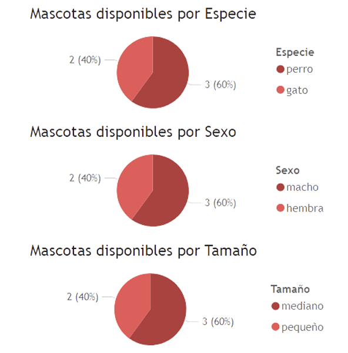
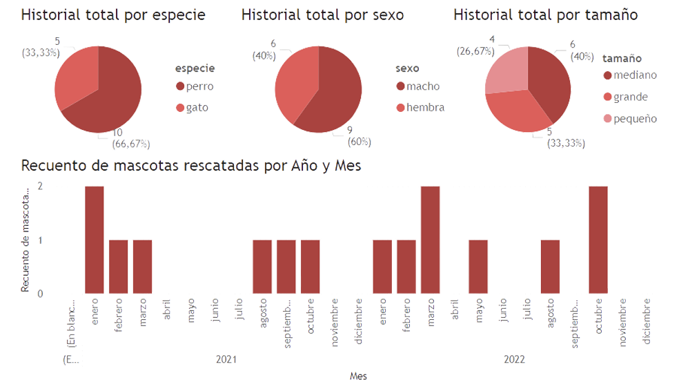

# Sistema de Gestión y Análisis de Datos para Rescate y Adopción de Mascotas

## 📊 Proyecto de Data Analytics

Este proyecto implementa un sistema completo de gestión y análisis de datos para una organización de rescate y adopción de mascotas, utilizando MySQL y Power BI.

### 🎯 Componentes Principales

#### Base de Datos
- **Tablas**: 15 tablas relacionales optimizadas
- **Vistas**: 6 vistas para análisis específicos
- **Procedimientos Almacenados**: 3 SP para automatización de procesos
- **Triggers**: 3 triggers para integridad de datos
- **Funciones**: 3 funciones personalizadas

#### Visualización de Datos
##### Dashboard de Métricas Clave

- Monitoreo en tiempo real de disponibilidad de mascotas
- Segmentación por especies y características

##### Análisis Temporal de Adopciones

- Patrones temporales de adopción
- Métricas de efectividad del programa

### 📚 Documentación y Scripts

1. [Documentación Técnica de la Base de Datos](https://github.com/Leo-Spj/SQL-CoderHouse/blob/main/Documentaci%C3%B3n%20BD.pdf)
2. Scripts de Implementación:
   - [ESTRUCTURA.sql](https://github.com/Leo-Spj/SQL-CoderHouse/blob/main/ESTRUCTURA.sql) - DDL
   - [DATOS.sql](https://github.com/Leo-Spj/SQL-CoderHouse/blob/main/DATOS.sql) - DML